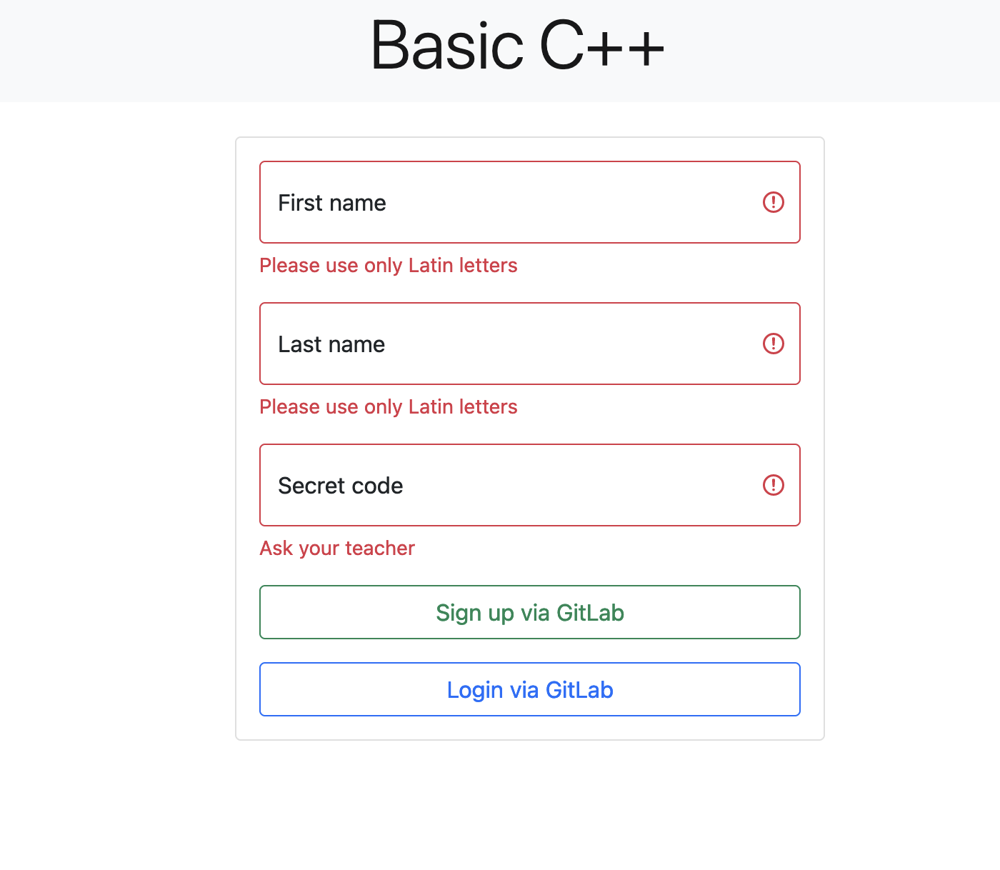
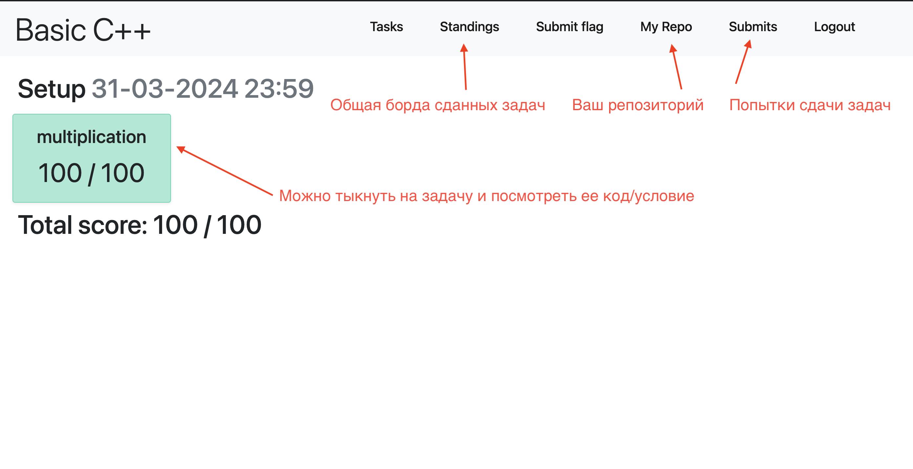
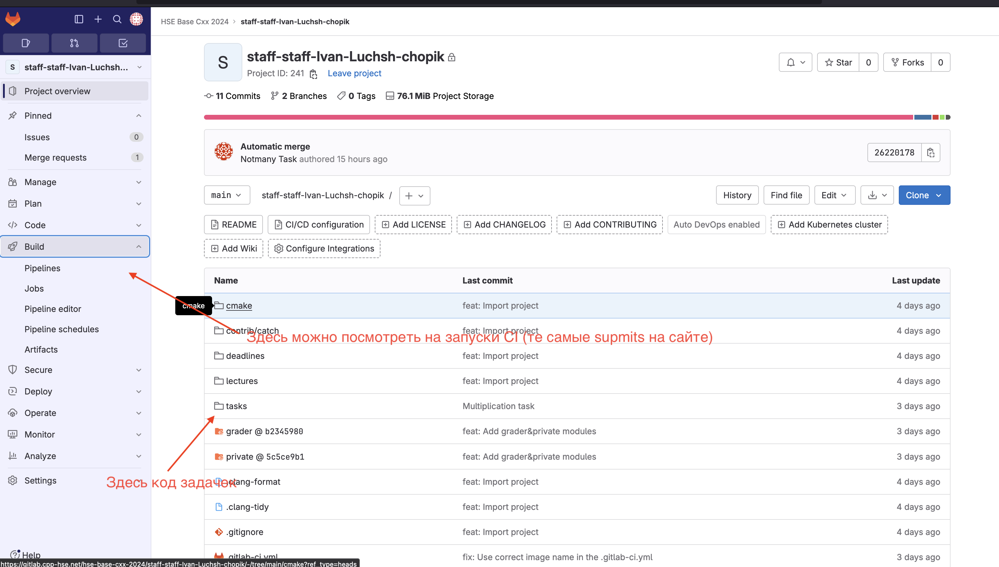
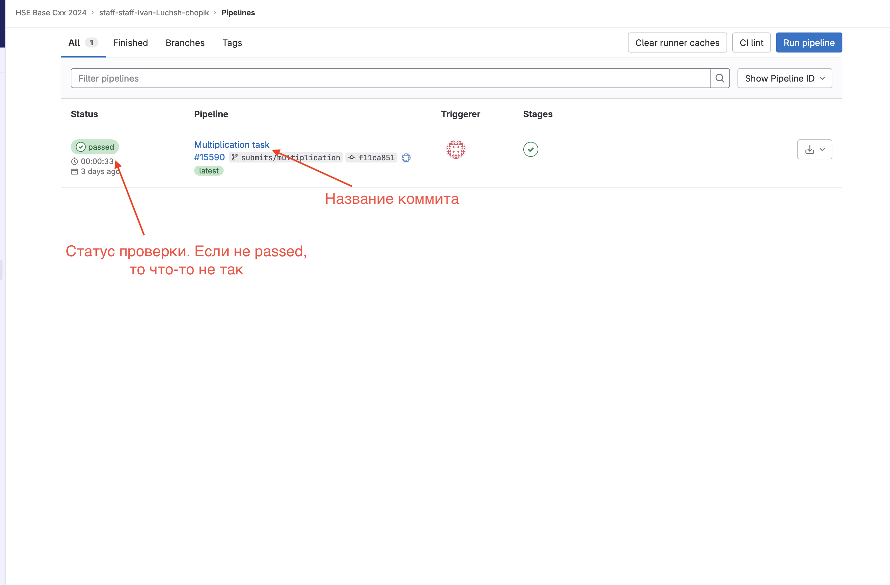

<style>
img[alt~="center"] {
  display: block;
  margin: 0 auto;
}
header h1 {
    margin-top:0;
    margin-left:15px
}
</style>

# Семинарист: Лущ Иван
# Ассистент: Артемов Михаил
---
# Чат в телеграме

https://t.me/+_8JYFx4OEklkZDky
---
---
# Репозиторий с материалами семинаров
<a href="http://qrcoder.ru" target="_blank"><center></center></a>
---
---
# Система для сдачи задач
Сайт: https://base.cpp-hse.net/signup
Секретный код сейчас кину в телеграме

---
---
# Интерфейс base.cpp-hse.net

---
---
# GitLab repo

---
---
# Страница запущенных пайплайнов (submits)

---
---
# Операционная система (ОС)
Тем у кого Linux, MacOS ничего делать дополнительно не нужно. А тем у кого Windows, то советую поставить WSL.

Ссылка на мой рассказ для пользователей Windows: https://github.com/Ch0p1k3/cpp-ami-2024/blob/main/etc/wsl.md
---
---
# Семинарская оценка

Формула оценки: 0.25 * домашние задания + 0.25 * проект + 0.2 * КР + 0.1 * Экзамен + 0.1 * Семинарская оценка

Возможно буду делать квизы (на 3-5 минут(ы)) в начале (конце) наших семинаров, возможно будут задачки
---
---
# IDE

Я буду пользоваться VSCode и вам рекомендую. На лекции еще говорилось про СLion, Neovim.
---
---
# IDE
| | VSCode | CLion | Neovim |
--- | --- | --- | --- |
Цена | Бесплатный | Платный, но можно получить лиц. для студентов | Бесплатный |
Гибкость | Взаимодействие с множеством языков и не только (LaTeX, Marp) | С++ | Взаимодействие с множеством языков и не только |
Порог вхождения | Средний | Легкий | Тяжелый |
---
# VSCode

## Установка

Переходим по [ссылке](https://code.visualstudio.com/), скачиваем и устанавливаем.

## Плагины
- [clangd](https://marketplace.visualstudio.com/items?itemName=llvm-vs-code-extensions.vscode-clangd) - go-to-definition, intellisense, подсвечивание ошибок и т. д.
- [CMake Tools](https://marketplace.visualstudio.com/items?itemName=ms-vscode.cmake-tools) - для поддержки СMake в VSCode. Позволяет собирать и запускать таргеты СMake по кнопкам в VSCode.
- [CMake](https://marketplace.visualstudio.com/items?itemName=twxs.cmake) - подсветка синтаксиса и автодополнение СMake. Пока опционально, но скорее всего вы будете писать свои CMake файлы.
---
# VSCode

- [WSL](https://marketplace.visualstudio.com/items?itemName=ms-vscode-remote.remote-wsl) - для пользователей Windows, которым нужно подключиться к WSL.
- [Sort lines](https://marketplace.visualstudio.com/items?itemName=Tyriar.sort-lines) - вообще необязательно, но я с помощью этого расширения сортирую инклюды.

---
# Установка последней стабильной версии clang
## MacOS
```zsh
brew install llvm
```
## Linux с Advanced Packaging Tool (APT)
https://apt.llvm.org/
```bash
sudo bash -c "$(wget -O - https://apt.llvm.org/llvm.sh)"
ln -s /usr/bin/clang++-17 /usr/bin/clang++
```
