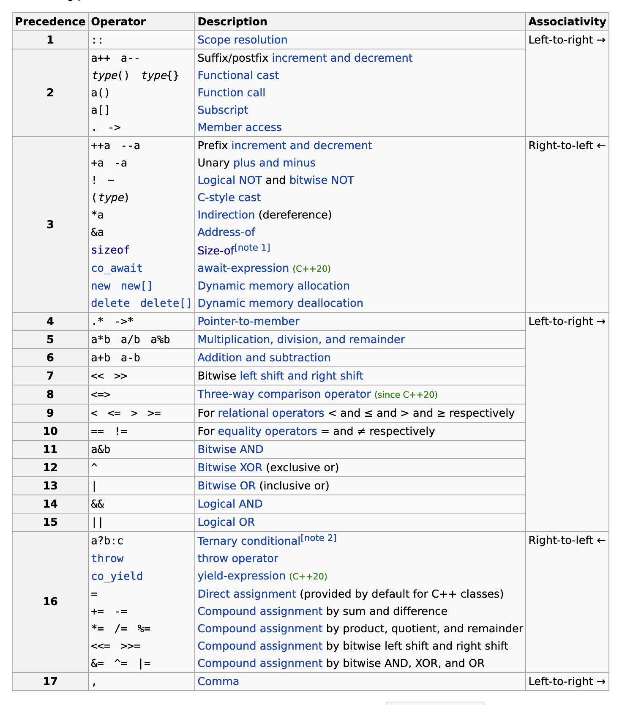
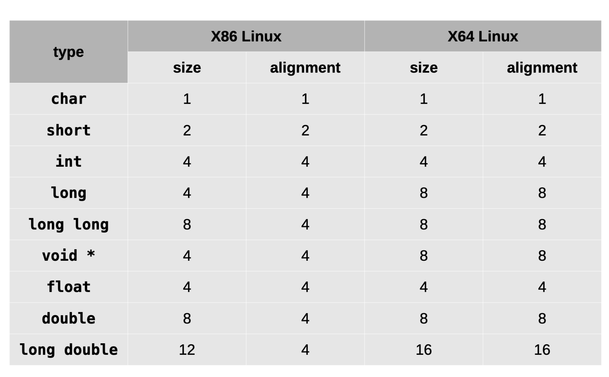

<style>
img[alt~="center"] {
  display: block;
  margin: 0 auto;
}
header h1 {
    margin-top:0;
    margin-left:15px
}
</style>

# Приоритеты операторов

- https://en.cppreference.com/w/cpp/language/operator_precedence
---
# Указатели, ссылки, время жизни объектов
- [ptr.cpp](code/ptr.cpp)
---
# Текстовая информация
- Представление строки - это последовательность байт.
- `char[]`, где в конце ставится `\0` байт, который является нулевым байтом и обозначает конец строки.
- [`cstring`](https://en.cppreference.com/w/cpp/header/cstring) - работа со строками, которая пришла с `C`.
- в `C++` пользуются [`std::string`](https://en.cppreference.com/w/cpp/string) классом
---
# Выравнивание
- Выравнивание - гарантирует размерещение переменной так, чтобы адрес размещения был кратен размеру выравнивания
---
# Невыровненные данные
- На некоторых платформах вызывает `Bus Error`
- Обращение к невыровненным данным требует два цикла обращения к памяти вместо одного
- `Undefined behavior`
---
# Sizeof & alignof

---
---
# Struct
```cpp
struct Structure {
    char f1;
    long long f2;
    char f3;
};
```
- `sizeof(Structure) == 24` на `X86-64`
```cpp
struct Structure {
    long long f2;
    char f1;
    char f3;
};
```
- `sizeof(Structure) == 16` на `X86-64`
---
# Struct
```cpp
struct Structure {
    char f1; // offset: 0
    // padding + 7
    long long f2; // offset: 8
    char f3; // offset 9
    // padding +7
};
```
Максимальное выравнивание - 8 (поле f2), поэтому:
  - `Structure` требует выравнивания 8
  - `sizeof(Structure)` должен быть кратен 8

[struct.cpp](code/struct.cpp)
---
---
# Enum
```cpp
enum class Color {
    RED,
    GREEN,
    YELLOW,
};
```
```cpp
auto color = Color::GREEN;
auto color2 = Color::RED;
```
---
# Enum
```cpp
switch (color) {
case Color::RED:
    std::cout << "RED" << std::endl;
    break;
case Color::GREEN:
    std::cout << "GREEN" << std::endl;
    break;
case Color::YELLOW:
    std::cout << "YELLOW" << std::endl;
    break;
default:
    // UNREACHABLE
    std::abort();
}
```
---
# Константы
```cpp
namespace task_constants {
    constexpr uint64_t UINT64CONST = 64;
    constexpr auto STRINGCONSTANT = "da"; // char*
    constexpr std::string_view STRINGVIEWCONST = "da";
}
```
